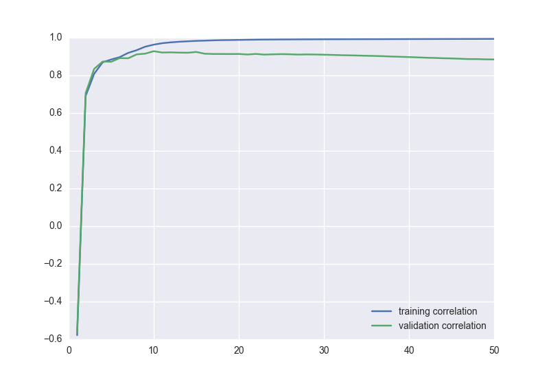
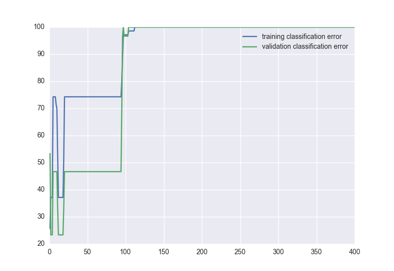

.. _convergenceplots:

Neural Net convergence plots with pySkyNet
==========================================

Using **pySkyNet** is trivial to create convergence plots of the trained neural network for either
regression of classification. For plotting we recommend the `seaborn library <http://web.stanford.edu/~mwaskom/software/seaborn/>`_ .
Although it will work with matplotlib.

Here is an example on how to obtain the convergence plots:

Setup:

.. code:: python

    from sklearn.datasets import load_boston
    from sklearn.util import shuffle
    from SkyNet import SkyNetRegressor

    # X are the features and y are the targets
    # shuffle returns a random permutation
    X,y = shuffle(load_boston().data,load_boston().target)

    X_train = X[0:200]
    y_train = y[0:200]

    X_valid = X[200:400]
    y_valid = y[200:400]

    sn_reg = SkyNetRegressor(id = 'identification_reg', n_jobs = 1, activation=(3, 3, 3, 0), layers = (10, 10, 10), max_iter=200)
    sn_reg.fit(X_train,y_train,X_valid,y_valid)

Error squared as function of steps:

.. code:: python

    sn_reg.error_dataframe.plot()

.. image:: error.png

Correlation as a function of steps:

.. code:: python

    sn_reg.corr_dataframe.plot()

When `SkyNetClassifier` is called, you can plot also plot the misclassification rate as a function of steps.

.. code:: python

    sn_cla.class_dataframe.plot()

